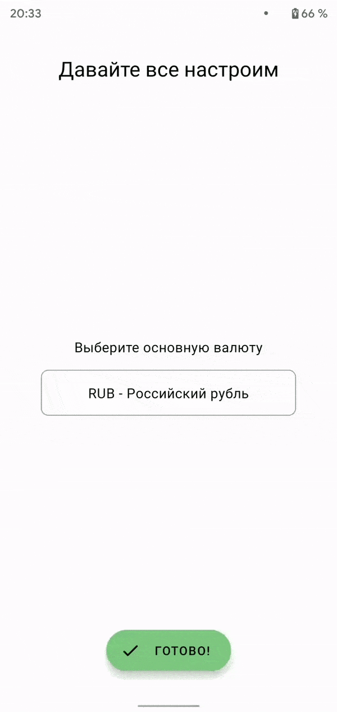

APKs are hosted on [AppCenter](http://https://install.appcenter.ms/users/gregamer-gmail.com/apps/finances/distribution_groups/public "AppCenter")
# Tech stack:
- **Kotlin** for all code
- **Kotlin serialization** for parsing JSONs
- **Gradle Kotlin DSL** for build scripts configuration
- **Multi module architecture** for faster builds and code separation
- **Clean architecture** for architecture
- **Coroutines** for async work
- **Java 8 desugaring** for working with date and time
- **Dagger 2** for DI
- **MVI** for handling screen state and logic
- **Firebase** (Authentication, Firestore) for storing data
- **Jetpack** (Navigation, ViewModel, LiveData, Lifecycle) for presentation layer
- **Material Components** for styling UI components and transitions
- **Motion layout** for animating some layouts
- **Coil** for images loading
- **Beagle** for debug menu
- **Strikt** for building assertions in tests
- **Spek** for unit tests
- **MockK** for mocks
# Screenshots
## Onboarding

## Dashboard
